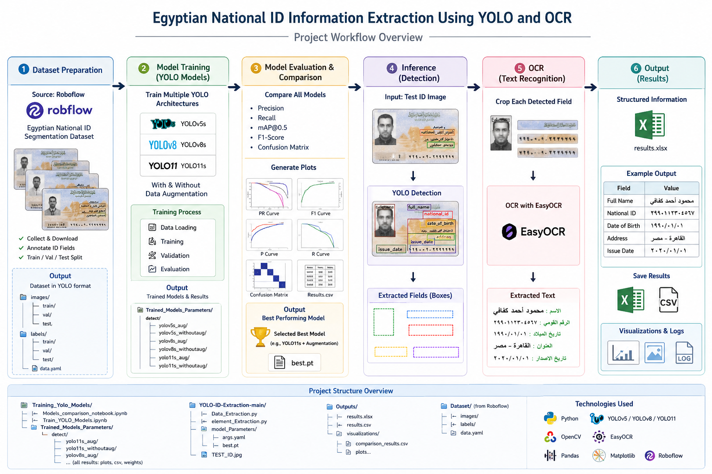

## Project Workflow

  

## Dataset

The dataset used in this project is available on Roboflow Universe:

- Egyptian ID Segmentation Dataset:
  https://universe.roboflow.com/fsococ/egyptian-id-seg-r4h5w/dataset/1

Dataset classes:
- Code
- Image
- City
- Family Name
- Name
- Neighborhood
- Number
- State

The dataset was used to train and evaluate YOLOv5s, YOLOv8s, and YOLO11s models for field detection and information extraction.